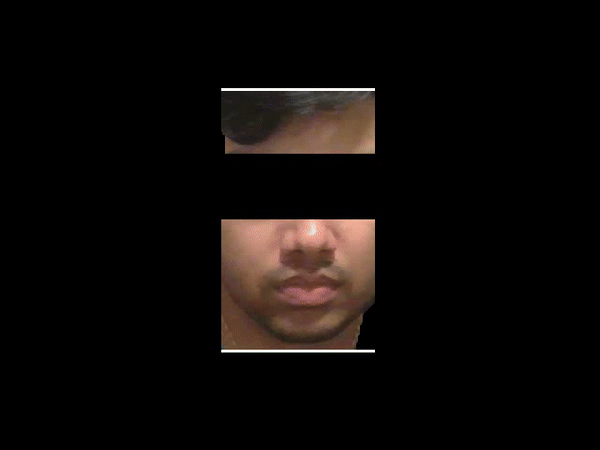

# Heartbeat Detection from Video

## Authors:
- Satvik Pandey
- Mahesh Kodavati

## Project Description
This project aims to detect heart rate from video using computer vision and signal processing techniques, specifically focusing on facial regions. The project leverages Photoplethysmography (PPG) to measure subtle changes in skin color related to blood volume changes caused by the cardiac cycle. It incorporates a combination of traditional methods such as Haar Cascade, GrabCut, and more recent advancements like Eulerian Video Magnification (EVM) and MTCNN for face detection. The project was initially developed during our final semesters in college, but recently, I found the motivation to revisit it and implement new techniques such as Auto Correlation, MTCNN for face detection, and averaging frames to calculate heart rate more accurately.

## Methodology
1. **Face Detection and Segmentation:**
   - **Haar Cascade:** Initially, the face is detected using Haar Cascade classifiers from OpenCV. 
   - **GrabCut Segmentation:** For better precision, GrabCut is applied to segment the face region, focusing on the forehead for accurate heart rate detection. 
   - **MTCNN:** Recently added as an alternative option for face detection, MTCNN provides more robust detection capabilities.

2. **Region of Interest (ROI):**
   - The forehead region is used as the primary area for heart rate analysis. This region avoids noise from eye movements and is optimal for detecting plethysmographic signals.

3. **Heart Rate Detection:**
   - **Eulerian Video Magnification (EVM):** Applied to amplify subtle movements in the face linked to the heartbeat.
   - **Signal Extraction:** The green channel from the segmented ROI is analyzed as it provides the strongest plethysmographic signal.
   - **Auto Correlation:** A new method implemented to replace FFT for detecting periodic peaks corresponding to the heart rate.
   - **Frame Averaging:** A sliding window of 30 frames is used to average the heart rate, ensuring smooth and stable output.

4. **Result Overlay:**
   - The detected heart rate is overlaid on the original input video for easy visualization, while the processed magnified video is used for heart rate calculation.

## Project Structure
- `Face_ROI.py`: Handles face detection and segmentation using HaarCascade, GrabCut, and MTCNN, and applies EVM to the selected region for heart rate detection.
- `Heartbeat.py`: Reads the processed ROI video and calculates the heart rate based on the Auto Correlation technique.
- `GrabCut.py`: A referenced implementation of GrabCut from Stanford's 'Measuring Heart Rate from Video' paper by Isabel Bush.
- `GrabCut_v2.py`: The modified GrabCut algorithm developed during this project for more reliable segmentation.
- `hrFaceDetection.py`: A utility script from Stanford's original work that helps detect the face for heart rate measurement.
- `record_video.py`: A script to record video inputs for the heart rate detection system.
- `results/`: Stores the magnified videos and final videos with overlaid heart rate.
- `videos/`: Contains input videos used for testing and analysis.
- `README.md`: This documentation.
  
## Requirements
- Python 3.8+
- OpenCV
- TensorFlow
- MTCNN
- NumPy
- SciPy
- Matplotlib

## Results
The results of the project demonstrate that heart rate can be detected with an error margin of approximately ±5 bpm in ideal conditions. The use of Auto Correlation improved stability, particularly in lower light settings, compared to FFT-based methods.

| Processed Video | Heart Rate Overlay |
| --------------- | ------------------ |
|  |  |

## Conclusion
This project demonstrates the feasibility of non-invasive heart rate detection using only video input. By leveraging video magnification and advanced signal processing techniques, heart rate detection can be achieved with reasonable accuracy under ideal conditions. Under perfect conditions—with a single source of light, minimal movement, and the best ROI being the forehead region (provided no hair covers it)—it is possible to achieve an error margin of ±5 bpm.

The implementation of Auto Correlation, MTCNN for face detection, and using a 30-frame average for heart rate stability helped me improved performance in face detection and signal extraction especially the double peaking and sudden spike with even a little light variation. However, challenges remain, particularly with variations in lighting and camera quality.

The inspiration for this project came from Isabel Bush's paper [Measuring Heart Rate from Video](https://web.stanford.edu/class/cs231a/prev_projects_2016/finalReport.pdf) from Stanford University, which laid the foundation for the method we developed.

## Further Improvements
1. **Enhancing Robustness:** The current system struggles with dynamic lighting conditions and varying camera qualities. Improving robustness against these environmental factors would make the system more reliable.
   
2. **Incorporating Neural Networks:** Recent advancements in neural networks for vital sign detection offer potential for better accuracy and robustness. Exploring these methods could yield significant improvements.

3. **Refining ROI Segmentation:** While the current GrabCut-based ROI segmentation works well in many cases, it is not always reliable. Further refinement is needed for consistent results, particularly in challenging scenarios such as occlusions or low light.

4. **Improving User Interface:** The project could benefit from an improved graphical interface for easier usage, visualization, and real-time monitoring.

---

